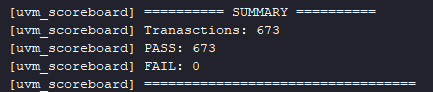
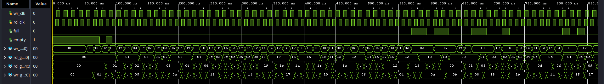
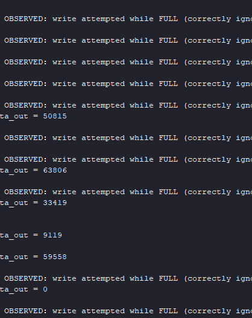
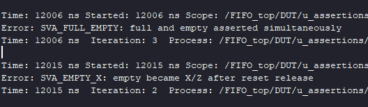

# Asynchronous FIFO Verification Environment (UVM Testbench)

This project implements a UVM-based verification environment for a 16-bit-wide, 16-deep asynchronous FIFO — two independent clock domains for write and read, Gray-code pointer synchronization, and a queue-based scoreboard model, following the standard UVM layered architecture (sequence, sequencer, driver, monitor, scoreboard, functional logging) with two parallel agents coordinated through a virtual sequencer.

## Design Under Test (DUT)

An asynchronous FIFO with:

- Independent write (`wr_clk`) and read (`rd_clk`) clock domains, with separate, per-domain active-low resets
- `DATA_WIDTH = 16`, `DEPTH = 16` (`ADDR_WIDTH = $clog2(DEPTH) = 4`), fully parameterized
- Gray-code pointers with a 2-flip-flop synchronizer crossing each pointer into the opposite clock domain, and the classic "extra address bit + inverted-MSBs comparison" technique to distinguish `full` from `empty`

```verilog
module FIFO_Design #(parameter DATA_WIDTH = 16, parameter DEPTH = 16)(
    input                       w_clk,
    input                       rd_clk,
    input      [DATA_WIDTH-1:0] data_in,
    input                       w_rst_n,
    input                       rd_rst_n,
    input                       wr_en,
    input                       rd_en,
    output                      full,
    output                      empty,
    output     [DATA_WIDTH-1:0] data_out
);
```

Built from six independently-scoped sub-modules:

- **`FIFO_gray_counter`** — a counter that tracks the current write/read position and exposes it in two forms simultaneously: binary (used directly to index the memory) and Gray-coded (used only for the cross-domain crossing, since Gray code changes exactly one bit per increment, eliminating the risk of a synchronizer capturing a torn, partially-updated value).
- **`FIFO_sync_ff`** — a 2-flip-flop synchronizer. The first stage can go metastable when it samples a signal that's asynchronously changing relative to its own clock; the second stage gives that first stage a full clock period to settle before anything downstream reads it. Used twice — once per pointer-crossing direction.
- **`FIFO_mem`** — the storage array itself, with a genuinely independent write port (on `wr_clk`) and read port (on `rd_clk`), exactly like a dual-clock RAM.
- **`FIFO_write_ctrl`** / **`FIFO_read_ctrl`** — hold the write/read pointer and derive `full`/`empty`. Critically, `full`/`empty` are computed from a _look-ahead_ value (`wr_bin_next`/`rd_bin_next`) — what the pointer _would_ become if the current operation is allowed — rather than the already-registered current pointer. Without this look-ahead, the flag would assert one cycle too late, letting an extra write/read slip through before the FIFO protects itself.
- **`FIFO_Design`** — the top-level module that wires the six sub-modules together per the interface below.

## Verification architecture

Because the DUT has two genuinely independent clock domains, the testbench mirrors that split at every level: two full agents (`FIFO_wr_agent`, `FIFO_rd_agent`), each with its own sequencer, driver, and monitor, plus a `FIFO_virtual_sequencer` that lets a single `FIFO_virtual_sequence` `fork`/`join` a write sequence and a read sequence so both run concurrently for the whole test.

The interface (`FIFO_inf`) uses four separate `clocking` blocks (`drv_cb_wr`, `drv_cb_rd`, `mon_cb_wr`, `mon_cb_rd`) paired with matching `modport`s, so that, for example, the write driver's handle is typed `virtual FIFO_inf.DRIVER_WR` and can _only_ reach `drv_cb_wr` — a compile-time guarantee against a driver accidentally writing a read-side signal, or bypassing the clocking block's timing skew entirely.

- **Sequences** — `FIFO_wr_seq` drives `data_in` with a weighted distribution (20% zero, 20% max, 60% mid-range) and forces `wr_en == 1` every cycle (a "productive" write stream); `FIFO_rd_seq` randomizes `rd_en` freely (~50/50), modeling a consumer with a variable, unpredictable read rate.
- **Drivers** — each drives its side of the interface through its clocking block and independently asserts/deasserts its own domain's reset at the start of `run_phase`.
- **Monitors** — passively observe their domain's clocking block. The read monitor in particular has to account for `FIFO_mem`'s registered read port: `data_out` becomes valid one `rd_clk` cycle _after_ the `rd_en` that requested it, so the monitor pipelines a one-cycle "pending" flag rather than sampling `rd_en` and `data_out` in the same cycle (see the second bug below for what went wrong with this pipelining logic before it was fully correct).
- **Scoreboard** — unlike a computed reference model, the reference "model" here is simply a SystemVerilog queue: every observed write's `data_in` is `push_back`-ed, and every observed read compares its `data_out` against `pop_front()`. This directly encodes FIFO semantics (first in, first out) without any arithmetic — the queue _is_ the specification.

Both clock periods were tuned deliberately, not left at their initial values: `wr_clk` started twice as fast as `rd_clk`, which kept the FIFO almost permanently full and starved the `empty` condition of any real testing. The rates were rebalanced — writes slowed down slightly, reads sped up — specifically so that `empty` would also occur naturally during regression, without making the two clocks equal (which would have undermined the point of testing genuinely asynchronous, unrelated clock domains).

## Real bugs found during development

### 1. A silent testbench: everything ran, nothing was ever reported

Early on, after fixing all compile-time issues, the simulation ran to completion (`$finish` reached, no fatals) but the console produced **zero** scoreboard output — no PASS, no FAIL, nothing — despite `repeat(1000)` transactions supposedly having been generated on both sides.

**Root cause:** `wr_en`, `rd_en`, and `data_in` had no default value in the interface, so at time zero they were `X`. The very first clock edge after reset release happens _before_ the driver (which only starts driving after its own `reset()` task and the sequencer handshake) has produced a defined value — so the DUT's own registers (`bin_count` in `FIFO_gray_counter`, updated unconditionally every cycle from `bin_count + en`) latched that transient `X` permanently. Once `X` enters a register with feedback like this, it never clears itself: `full`/`empty` stayed `X` for the rest of the simulation, so the monitors' `wr_en && !full` / `rd_en && !empty` gating conditions evaluated to false forever, and no transaction was ever reported — with no error printed anywhere, because nothing ever became invalid, it simply never became _valid_.

**Fix:** give `wr_en`, `rd_en`, and `data_in` explicit default values (`= 1'b0`, `= '0`) directly in the interface declaration, closing the undefined window before the driver takes over.

### 2. A testbench bug hiding behind what looked like an RTL bug

After rebalancing the clocks (bug 1 above) to bring the two rates closer together, the scoreboard started reporting a new class of failure:

```
WRITE observed while queue already at DEPTH (16)! data_in = 65535 — possible full-flag bug
FAIL : expected : 0 | data_out : 65535
```

At first glance this looked like a genuine CDC bug exposed by the tighter clock ratio — exactly the kind of corner case async FIFOs are notorious for. Manually decoding the Gray-coded pointers captured in the waveform at the failure instant told a different story:

| Signal                      | Gray value | Decoded (binary)     |
| --------------------------- | ---------- | -------------------- |
| `wr_gray_next`              | `10101`    | 25 total writes      |
| `rd_gray_sync`              | `11110`    | 20 total reads       |
| **Real DUT occupancy**      |            | **5 items**          |
| **Scoreboard's queue size** |            | **16 items (wrong)** |

The DUT's own `full` computation (`wr_gray_next` vs. the inverted-MSB target) was correct and matched a real occupancy of only 5 items — nowhere near full. The divergence was entirely in the testbench's bookkeeping.

**Root cause:** `FIFO_rd_monitor` checked "was this cycle an invalid read attempt (`rd_en && empty`)?" and "is there a valid read pending from _last_ cycle, now ready to report?" using `if / else if` — but these two conditions describe _different points in time_ and are not mutually exclusive. Whenever a valid read was immediately followed by a cycle where `rd_en && empty` happened to be true, the pending report from the valid read was silently dropped — the DUT had genuinely completed that read, but the monitor never told the scoreboard, so the queue accumulated one un-popped entry every time this pattern occurred, eventually appearing to "overflow" past `DEPTH`.

**Fix:** replace `if / else if` with two independent `if` statements — reporting the previous cycle's pending read and checking the current cycle's empty-attempt are unrelated events and must not be allowed to suppress each other.

**Lesson:** `if / else if` is only safe when both branches describe the _same_ instant in time. As soon as one branch refers to "what happened last cycle" and the other to "what's happening now," they need to be independent `if` blocks — a good general rule for any pipelined/latency-aware monitor.

### A side observation from the rebalanced clocks

With writes still slightly faster than reads (deliberately, see above), "write attempted while FULL" was observed far more often than "read attempted while EMPTY" (321 vs. 25 occurrences over the full run) — and the _timing_ differed too: `full`-blocked writes clustered mainly in the middle of the run, once the FIFO had had time to fill, while `empty`-blocked reads clustered near the very start (before anything had been written yet) and again near the very end (once the write sequence had finished its 1000 iterations and only reads continued). This matches the intended producer-dominant scenario and is a reasonable pattern to point to as evidence the clock rebalancing achieved its goal, rather than something to "fix" further.

## Testbench validation via mutation testing (bug injection)

_(planned, following the same methodology used in the [ALU project](https://github.com/Daniel-eleng/UVM_ALU): a set of `bug-injection/_`branches, each starting from a clean copy of`main` and introducing exactly one deliberate RTL fault — likely candidates include corrupting the Gray-to-binary conversion, breaking the full/empty comparison logic, or removing a synchronizer stage — to confirm the testbench detects each one. This section will be updated with the branch table and results once completed.)\*

## SystemVerilog Assertions

Alongside the UVM testbench, a small set of concurrent assertions (`Testbench/FIFO_assertions.sv`) checks black-box, interface-level properties directly against the DUT, attached via `bind` so `FIFO_Design.v` itself is never modified:

- **No `X`/`Z` on `full` after `wr_rst_n` release**, and the same check on **`empty`** after `rd_rst_n` release.
- **`full` and `empty` are never asserted simultaneously.**

**Validation:** rather than trust that the assertions were correctly wired up just because the simulation stayed silent, the reset-boundary `X`-propagation bug described above (bug #1) was deliberately reintroduced by temporarily removing the interface's default signal values. Re-running the simulation immediately produced `SVA_FULL_X: full became X/Z after reset release` in the console — confirming the checker genuinely detects the exact class of bug it was written for, not just passing by coincidence. The fix was then reverted and the clean run (674/674 PASS, 0 FAIL, no assertion failures) was reconfirmed before committing.

## Project structure

| Folder/File                                               | Description                                                                                    |
| --------------------------------------------------------- | ---------------------------------------------------------------------------------------------- |
| `Design/FIFO_Design.v`                                    | Top-level DUT module, wires all sub-modules together                                           |
| `Design/FIFO_gray_counter.v`                              | Binary + Gray-code pointer counter (used for both write and read pointers)                     |
| `Design/FIFO_sync_ff.v`                                   | 2-flip-flop cross-domain synchronizer                                                          |
| `Design/FIFO_mem.v`                                       | Dual-clock storage array                                                                       |
| `Design/FIFO_write_ctrl.v`                                | Write pointer + look-ahead `full` computation                                                  |
| `Design/FIFO_read_ctrl.v`                                 | Read pointer + look-ahead `empty` computation                                                  |
| `Testbench/FIFO_pkg.sv`                                   | Package including all UVM class files, in dependency order                                     |
| `Testbench/FIFO_inf.sv`                                   | Virtual interface: signals, 4 clocking blocks, 4 matching modports                             |
| `Testbench/FIFO_wr_item.sv` / `FIFO_rd_item.sv`           | Transaction classes (parameterized on `DATA_WIDTH`)                                            |
| `Testbench/FIFO_wr_sequencer.sv` / `FIFO_rd_sequencer.sv` | Sequencers                                                                                     |
| `Testbench/FIFO_wr_sequence.sv` / `FIFO_rd_sequence.sv`   | Sequences generating constrained-random transactions                                           |
| `Testbench/FIFO_virtual_sequencer.sv`                     | Holds handles to both real sequencers, for coordinated multi-domain sequencing                 |
| `Testbench/FIFO_virtual_sequence.sv`                      | Starts the write and read sequences concurrently via `fork`/`join`                             |
| `Testbench/FIFO_wr_driver.sv` / `FIFO_rd_driver.sv`       | Drivers, including per-domain reset sequences                                                  |
| `Testbench/FIFO_wr_monitor.sv` / `FIFO_rd_monitor.sv`     | Monitors (read monitor pipelines a one-cycle "pending" flag, see above)                        |
| `Testbench/FIFO_wr_agent.sv` / `FIFO_rd_agent.sv`         | Agents (driver + monitor + sequencer per domain)                                               |
| `Testbench/FIFO_scoreboard.sv`                            | Queue-based scoreboard, connected to both monitors via `uvm_analysis_imp_decl`-generated ports |
| `Testbench/FIFO_env.sv`                                   | Top-level environment: both agents, scoreboard, virtual sequencer                              |
| `Testbench/FIFO_test.sv`                                  | Test class, starts the virtual sequence on the environment's virtual sequencer                 |
| `Testbench/FIFO_top.sv`                                   | Testbench top: clock generation, interface instantiation, DUT connection, `run_test()`         |
| `Testbench/FIFO_assertions.sv`                            | Black-box SystemVerilog assertions, attached to `FIFO_Design` via `bind` (no RTL modification) |

## How to run

1. Open Vivado and create a new project.
2. Add all files under `Design/` as design sources.
3. Add `Testbench/FIFO_pkg.sv`, `Testbench/FIFO_inf.sv`, and `Testbench/FIFO_top.sv` as simulation sources.
   - **Important:** do not add the individual class files (`FIFO_wr_driver.sv`, `FIFO_rd_monitor.sv`, etc.) as separate simulation sources — they are pulled in through `` `include`` inside `FIFO_pkg.sv`. Grouping all UVM classes into a package this way avoids compile-order issues, since the simulator otherwise resolves file order from static instantiation hierarchy, which doesn't apply to classes selected dynamically via `run_test()`.
4. Set the simulation top module to `FIFO_top`.
5. Run behavioral simulation (`launch_simulation` / Run All). Vivado launches with a default runtime of 1000 ns, which is far short of what's needed for both 1000-iteration sequences to complete across two independent clock domains.
6. **After** the initial launch, type `run -all` in the Tcl console and press Enter, so the simulation runs until UVM itself calls `$finish`, instead of stopping at a fixed, guessed time value.
7. Check the Tcl console for the scoreboard summary (PASS/FAIL counts).

## Git workflow

This project uses branches to isolate experiments from the main, verified codebase:

- `main` — correct, working DUT and UVM testbench.
- `bug-injection/*` — each branch introduces exactly one deliberate RTL fault, starting from a clean `main`, to validate that the testbench detects it. These branches are not merged into `main`.

## Results

### Summary



### Waveform: Gray-code pointers and `full`/`empty` across independent clock domains



### Console excerpt: both blocked-access classes observed




### Assertion validation: deliberately re-triggering the reset-boundary bug


